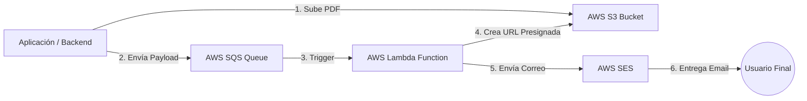
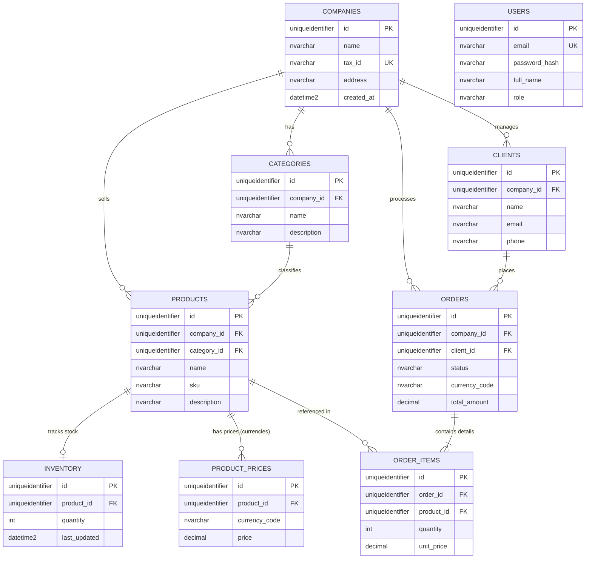

# Lite Thinking Test - Juan Pablo Rivadeneira

Este proyecto es un microservicio para la gestión de pedidos (Orders), desarrollado como parte de una prueba técnica. Implementa una arquitectura robusta utilizando las últimas versiones de Java y Spring Boot.

## Tecnologías Utilizadas

*   **Java 25** (OpenJDK)
*   **Spring Boot 4.0.1**
*   **Spring Data JPA** (Hibernate 7.2.0)
*   **Spring Security** (con soporte para JWT)
*   **Flyway** (Gestión de migraciones de base de datos)
*   **Microsoft SQL Server** (Base de datos principal)
*   **Docker & Docker Compose** (Orquestación de contenedores)
*   **Lombok** (Reducción de código boilerplate)
*   **GraalVM Native Image** (Soporte para compilación nativa)

## Arquitectura

El proyecto sigue un enfoque de **Arquitectura Hexagonal/Limpia**, separando las responsabilidades en las siguientes capas:

*   **`domain`**: Contiene las entidades de negocio, interfaces de repositorio y lógica core (independiente de frameworks).
*   **`application`**: Casos de uso y servicios que coordinan la lógica de negocio.
*   **`infrastructure`**: Implementaciones técnicas (REST Controllers, JPA Repositories, Configuración de Seguridad, Adaptadores externos).
*   **`config`**: Configuraciones generales de Spring.

## Requisitos Previos

*   Docker y Docker Compose instalados.
*   Java 25 (si deseas ejecutarlo localmente sin Docker).
*   Gradle (opcional, incluido vía `gradlew`).

## Configuración y Ejecución

### 1. Clonar el repositorio
```bash
git clone https://github.com/jpriva/jpriva-lite-thinking-test.git
cd jpriva-lite-thinking-test
```

### 2. Variables de Entorno

Copia el archivo de ejemplo y ajusta las credenciales si es necesario:

```bash
cp backend-orders/.env.example .env
cp backend-orders/.env.example backend-orders/.env
```

### 3. Ejecutar con Docker Compose

En linux, con las dependencias necesarias, este comando levantará la base de datos SQL Server, Localstack y la aplicación automáticamente para pruebas locales:

```bash
./service-up.sh --build
```
Si deseas usar Spring Boot Docker Compose Support (ejecutando solo la BD en Docker y el app local):

- Levanta solo la infraestructura(Sql Server + Localstack):
```bash
cd backend-orders
docker-compose up -d
cd terraform
terraform init
terraform apply
```
- Ejecuta el backend:
```bash
./gradlew bootRun
```
- Ejecuta el frontend:
```bash
cd ..
cd frontend-orders
npm run dev
```

### 4. Compilación nativa con GraalVM

Para compilar el proyecto en una imagen nativa utilizando GraalVM, asegúrate de tener GraalVM instalado y configurado correctamente.
Se requiere ejecutar las pruebas del proyecto para que los agenetes configurados lean las dependencias del proyecto.
Luego, ejecuta:

```bash
./gradlew clean test
./gradlew nativeImage
```

Esto generará una imagen nativa en el directorio `build/native-image`.

## Seguridad y Autenticación

El sistema utiliza JSON Web Tokens (JWT) para la seguridad.

- El endpoint `/auth/login` es público, junto con la documentacion `/swagger-ui/index.html`.
- El resto de los endpoints requieren el header: `Authorization: Bearer <token>`.
- Por defecto el sistema crea el usuario con un email configurado en la variable de entorno `DEFAULT_ADMIN_EMAIL` y contraseña en la variable de entorno `DEFAULT_ADMIN_PASSWORD`, al modificar las variables podra ingresar al sistema.
- Desde el Usuario Administrador podra crear otros usuarios.

## Estructura de Endpoints Principales

- Auth: POST /auth/login, POST /auth/register
- Orders: GET/POST /api/orders
- Clients: GET/POST /api/clients
- Products: GET/POST /api/products
- Companies: GET/POST /api/companies
- Categories: GET/POST /api/categories

## Pruebas

Para ejecutar la suite de pruebas (JUnit 5 + Testcontainers):

```bash
./gradlew test
```

El proyecto utiliza Testcontainers para levantar una instancia efímera de SQL Server y Localstack durante los tests integrales.

## Dockerización

El proyecto está configurado para ser fácilmente desplegado con Docker. Puedes construir y ejecutar la imagen Docker con los siguientes comandos:

```bash
docker build -t backend-orders .
docker run -p 8080:8080 backend-orders
```

Esto levantará la aplicación en el puerto 8080.

## AWS

Para el envio de correo con el PDF se realizó una integracion con colas SQS y Lambda con el Payload y el nombre del archivo en S3 para firmarlo y obtener una URL efimera para descargarlo. La Lambda envia el correo por SES. El despliegue se hizo por Terraform por el momento en LocalStack para pruebas.


## Base de datos



# Frontend

## Tecnologias

- Typescript 
- React 
- Vite
- MUI Material
- Axiom

## Metodologia

- Se realizaron algunos componentes con metodologia Atomic Design para garantizar reutilizacion y mantenimiento futuro de los componentes y paginas.

## Dockerización

Se genero el Dockerfile para la construccion de la imagen y despliegue en Nginx
